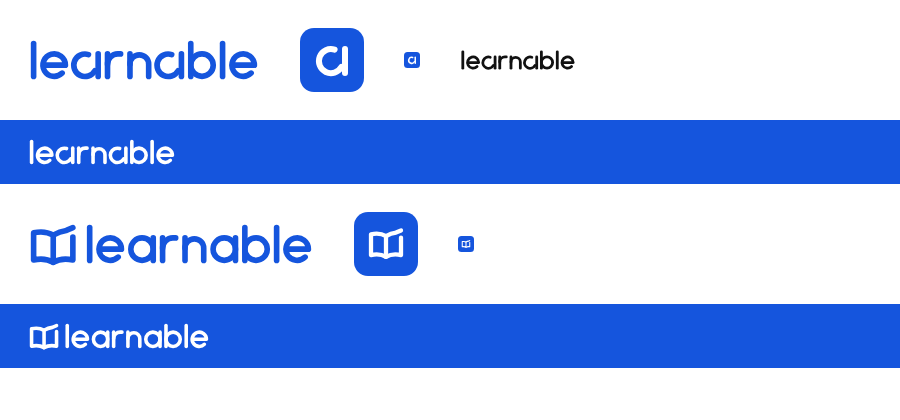

# LEARNABLE identity

Two concepts were drawn as original SVG from written descriptions. **Concept 5 is the provisional
default**; concept 3 is the prepared alternative. The owner hasn't chosen yet, so switching is one
line: `web/src/brand/active.ts`, then `node scripts/export-brand.ts` (in `web/`) to refresh the
favicon and app icon. There is deliberately no in-app logo setting.

## Concept 5 — distinctive wordmark (active)

- Lowercase "learnable" in friendly geometric letters drawn from strokes: stroke 6 on a
  41-unit letter height, round caps and joins, circles of radius 12.
- The custom "a": its bowl is an open loop that starts clear of the stem, circles round and
  returns into it, like a "go round again" arrow. That's the recall. It is closed at the bottom
  and joined to the stem, so it still reads instantly as an "a".
- The "a" alone is the compact mark and app icon (white on cobalt, rounded square).

## Concept 3 — pages in motion (alternative)

- A simplified open book: two page shapes meeting at the spine; the right page's outer edge
  lifts past the book into an upward stroke (learning that rises).
- The same lowercase wordmark with a plain single-storey "a".
- The book alone is its app icon.

## Assets

`web/public/brand/`, generated from `web/src/brand/geometry.ts`:

| File | Use |
|---|---|
| `<concept>-wordmark-blue.svg` | light backgrounds |
| `<concept>-wordmark-white.svg` | the blue navigation bar |
| `<concept>-wordmark-mono.svg` | one-colour print, embossing |
| `<concept>-mark-{blue,white,mono}.svg` | compact mark |
| `<concept>-app-icon.svg` | square icon (white mark on cobalt) |
| `web/public/favicon.svg`, `web/public/app-icon.svg` | the active concept's icon |

- **Colour:** cobalt `#1555DD` (`--brand` in the web styles; the navigation bar in light mode).
- **Construction:** paths and strokes only: no embedded raster, no font dependency, no
  gradients, shadows or animation. Legible down to a 16 px favicon.
- **Clear space:** at least the height of the "a"'s bowl (a quarter of the letter height) on
  every side; never on busy imagery.
- **In the app:** `BrandLogo` (`form="wordmark" | "mark"`, `tone="blue" | "white" | "mono"`)
  draws the geometry inline. It's decorative inside the home link, whose accessible name is
  "LEARNABLE home".
- The streak keeps its flame and XP its four-point star: neither uses the logo.
- iOS still uses its own app icon; adopting these assets there is a separate step.
